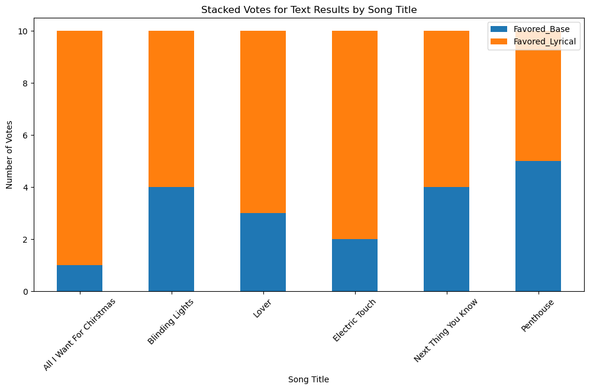

# LyricaLlama: A fintuned LLM for generating lyrics


### Fall 2023

### Grant Lewis

#### Links:

[Github](https://github.com/grantslewis/LyricaLlama)

[Dataset](https://www.kaggle.com/datasets/neisse/scrapped-lyrics-from-6-genres/)

[Finetuned Model](https://huggingface.co/grantsl/LyricaLlama)

[Original Model](https://huggingface.co/meta-llama/Llama-2-7b-hf)

-----

### Purpose
My goal for this project was to fine-tune a large language model (LLM) on lyrics from songs to enhance its creative output in generating song lyrics. Recognizing that LLMs often replicate what they're trained on without genuine creativity, I aimed to investigate whether fine-tuning could yield more original and contextually appropriate lyrics.

### Preparation
For this task, I chose the dataset from [kaggle](https://www.kaggle.com/datasets/neisse/scrapped-lyrics-from-6-genres/) and the [meta-llama/Llama-2-7b-hf](https://huggingface.co/meta-llama/Llama-2-7b-hf) model from Hugging Face. My selection was driven by the dataset's large, diverse collection of songs and the model's balance between size and capability.

### Data Preparation and Development
The dataset contained a strong skew towards Portuguese music, due to the data being collected from a Brazilian website. I opted to focus exclusively on the English subset, which still accounted for more songs than any other language, totaling 191,814 songs.  I was hoping to use the full dataset in training and testing, however, due to hardware constraints, I ended up using only 25% of English songs, resulting in a training set of 34,667 songs.  I felt that this size provided sufficient information for the model to learn from while still being manageable for how long it would take to train.

Technical difficulties emerged during the setup phase, particularly regarding dependency versioning conflicts involving bits-and-bytes. I am by no means an expert at MLOps and versioning, so resolving these issues required many iterations and a significant amount of troubleshooting and experimentation for me.  This resulted in me taking a deep dive into compatibility specifics.  However, I was able to learn a lot along the way, including how to better troubleshoot issues arrising from managing coplicated python environments that will be useful for me in future projects.

Part of the preparation required me to develop a solid prompt format for training the model.  I tested several different prompts and instructions, but ended up using the provided instructions and formatting since they seemed to work well with the base Llama model.  The prompt format is as follows:
```
### Instruction: You are a creative, world-famous expert lyricist. Write lyrics for a song, given just a title, artist name, possible genres, and any additional information provided.

### Input:
Write lyrics for a song titled "{song_name}" to be performed by {artist}[ using the following geners: {comma delimited list of genres}].

### Response:
{lyrics}
```
Note that the portion of text in square brackets was not included when no genres were provided.

### Training
I ran an initial small-scale training run to validate the training pipeline worked properly and that the model was being saved properly. Once I was happy with the results, I moved to full-scale training on the full trainingset.  However, I once again encountered unforeseen issues when scaling up for training. The process ended up hanging when loading data onto the GPU due to an increase in batch size. To mitigate the problem, I had to adjust the batch size slightly. I finetuned the model on the training set for 2 epochs over the course of three days.  Unfortunately there were several intermitent interruptions due to the server ending the process (not from run-time errors).  Fortunately, I had increased checkpointing during training so I was able to pick up from a recent checkpoint despite the crashes.  After training was completed, I uploaded the model to Hugging Face as [grantsl/LyricaLlama](https://huggingface.co/grantsl/LyricaLlama).

### Results
The testing phase, though short, was illuminating. I compared the outputs of the original Llama-2-7b and the finetuned LyricaLlama models for 6 different songs. 3 of the songs existed before the training data was collected and 3 new songs released this year. The assessment was based on subjective rankings by various individuals. The results leaned towards the finetuned model, indicating an improvement in lyric generation quality.  In all but one case, the finetuned model produced more coherent lyrics which the majority of people favored.  In the one instance where this wasn't the case, there was actually a tie between the two models.

In looking over the results of LyricaLlama, it can also be seen how it learned to keep lines shorter, and often make solid attempts at rhyming.  This is impressive to see, especially given the limited amount of time it was trained for.

It is also important to note that both models occasionally produced explicit language, reflecting the unfiltered nature of the training dataset. This highlights the impact of dataset composition on model output, an important consideration for future projects.

| Song_title               |   Favored_Base (Summed) |   Favored_Lyrical (Summed) | Index with Most Votes |  Index with Least Votes |
|:-------------------------|---------------:|------------------:|-------:|--------:|
| All I Want For Chirstmas |              1 |                 9 |      3 (Lyrical) |       0 (Base) |
| Blinding Lights          |              4 |                 6 |      5 (Lyrical) |       0 (Base) |
| Lover                    |              3 |                 7 |      4 (Lyrical) and 5 (Lyrical) |       0 (Base) |
| Electric Touch           |              2 |                 8 |      5 (Lyrical) |       0 (Base) |
| Next Thing You Know      |              4 |                 6 |      5 (Lyrical) |       1 (Base) |
| Penthouse                |              5 |                 5 |      1 (Base) and 5 (Lyrical) |       3 (Lyrical) |



### Lessons Learned and Future Work
This project was a great learning experience for me to better understand how to manage and correct issues in python environments as well as better understanding how LLM's work and how to fine-tune them.

In future iterations, I would explore varying the dataset composition further, perhaps by incorporating more variety in the instructions and format of the prompts.  I would also like to compare how different artists and genres impact the lyrics which the model produces. This could reveal more about the model's adaptability and creative range. Additionally, I would invest more time in the testing phase to gain deeper insights into the model's performance improvements.

### Conclusion
This project successfully demonstrated that fine-tuning an LLM on a specific dataset can enhance its performance in the creative task of generating lyrics, even if some of the lines were taken from other songs, and the model occassionally rambled.  However, I could see how this model could be used to spitball different ideas and come up with new ideas for additions to lyrics, even if the produced lyrics don't always meld well together.  I am extremely satisfyied with the results and that I was able to successfully finetune an LLM despite technical challenges.  It is also very satisfying to know that the model is on Hugging Face and available for others to be able to download and be able to play with. This project has helped solidify my experience with LLM's to improve my understanding and competency in the field of creative AI.

Note: I do not claim any ownership on song lyrics found in the dataset. Song Lyrics used in this project are the intellectual property of others. This project is purely for educational purposes and is not intended to be used for any commercial use.
